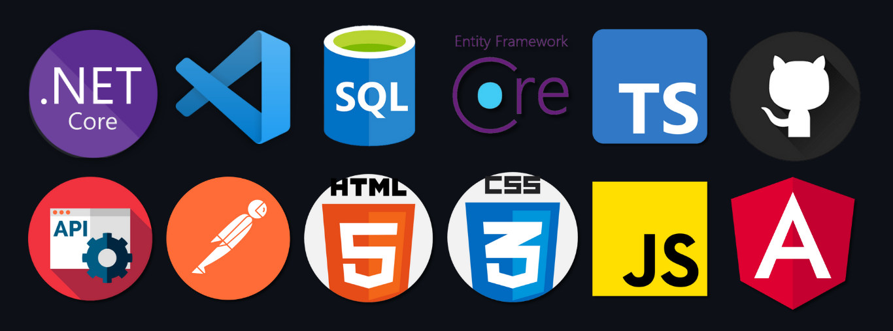

# Hi, I'm Daniel

### 🧑‍💻 About me
I am a **Software Engineer** with extensive knowledge in the field of software development. I have interpersonal skills to deal with people in general and also have knowledge of agile development. I have knowledge in several tools, languages ​​and skills. Like **C#**, **Node.js**, **SQL**, **API's**, **clean and high performance code**. I am a fluent English-speaker. Also, I am passionate about technology and I have a thirst to learn new technologies and acquire new knowledge.

---
### 💻 My Tech Skills

Here are some of the programs and tech skills that I master 😏:

## 🌴In my free time I like:

Let me tell you _ I study a lot😅. I like to read and watch tutorials on YouTube. I also like to walk with my dog, spend time with my family and friends and listen to music.
